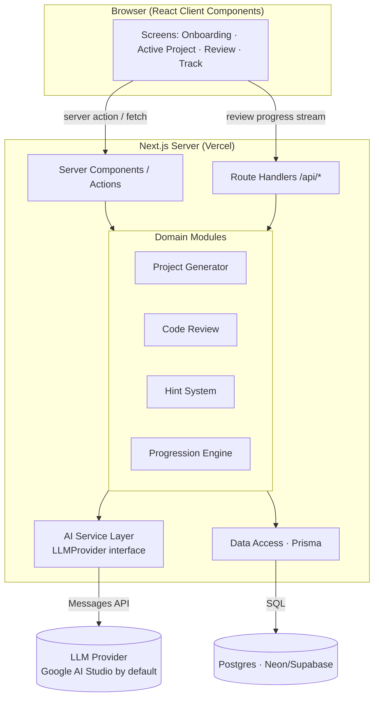
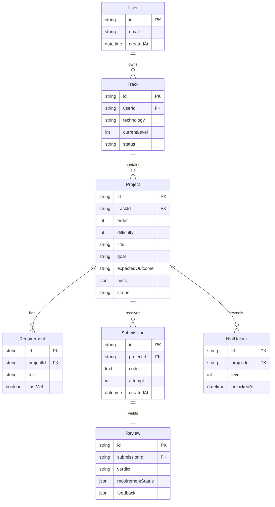
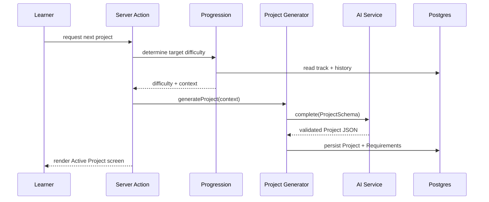
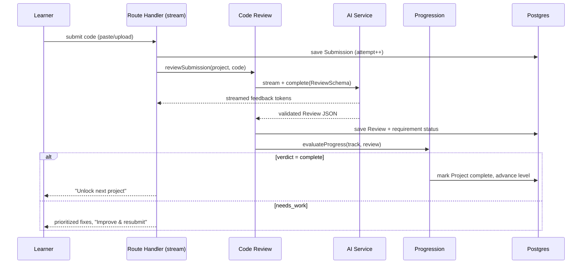
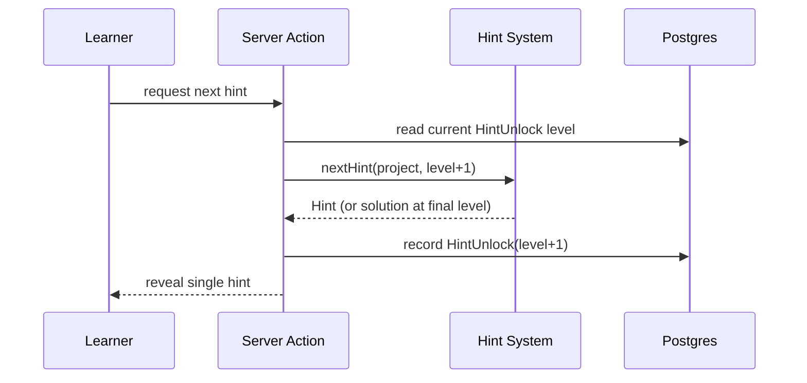

# Architecture — Learn By Building

**Document type:** System Design / Architecture
**Product:** Learn By Building
**Version:** 0.1 (MVP)
**Date:** 2026-07-16
**Companion doc:** `PRD-Learn-By-Building.md`

---

## 1. Overview & Goals

**Learn By Building** is an AI-mentor coding-education web app. Instead of lessons, an AI hands learners increasingly difficult projects, reviews their submitted code, and gates progression on demonstrated ability. This document describes the system design for the **MVP** (single React track, web only).

### Quality attributes (in priority order)
1. **Simplicity** — one codebase, minimal moving parts, no premature infrastructure.
2. **Maintainability** — clean module boundaries; each AI capability is independently testable behind an interface.
3. **Correctness** — deterministic completion criteria; structured, schema-validated AI output.
4. **Scalability** — stateless request handling, so horizontal scale is a deployment concern, not a redesign.

### Non-goals (MVP)
- In-app code execution / sandboxing.
- Real-time collaboration.
- Multi-provider LLM *orchestration* (we abstract the provider, but run one at a time).
- Native mobile.

---

## 2. High-Level Architecture

The system is a single Next.js (App Router) application. The browser talks to server actions and route handlers; all AI and database access happens server-side. The AI layer sits behind a provider-agnostic interface.



**Key idea:** the four domain modules are the only things that know *business rules*. They depend on two ports — `AIService` (for model calls) and repositories (for persistence) — and nothing else. UI never calls the LLM directly.

---

## 3. Tech Stack

| Concern | Choice | Why |
|---|---|---|
| Framework | **Next.js (App Router) + TypeScript** | One full-stack codebase; server-side AI calls keep keys safe; RSC + streaming fit the review UX. |
| UI | **React (Server + Client Components)**, Tailwind CSS | Simple, standard; minimal custom design system for MVP. |
| AI | **Provider-agnostic layer**, default **Google AI Studio (Gemini 2.5 Flash)** | Swappable behind an interface; Gemini is strong at code review/explanation. |
| Validation | **Zod** | One schema source for input validation *and* structured LLM output parsing. |
| Database | **Postgres** (Neon/Supabase serverless) | Relational data (users, projects, submissions) with clear foreign keys. |
| ORM | **Prisma** | Typed queries, migrations, good DX. |
| Auth | **Auth.js (NextAuth)** — Google OAuth | Google accounts persist learner progress; a credentials provider is limited to local development. |
| Hosting | **Vercel** | First-class Next.js support; serverless scaling. |

---

## 4. Module Breakdown

Each module exposes a **clean, testable interface** and holds no framework or transport concerns. This mirrors the PRD's "treat every AI capability as its own module" principle.

```
src/
  modules/
    project-generator/   # generateProject(context) -> Project
    code-review/         # reviewSubmission(project, code) -> Review
    hint-system/         # nextHint(project, level) -> Hint
    progression/         # evaluateProgress(track, review) -> NextStep
  ai/                    # LLMProvider interface + adapters
  data/                  # Prisma client + repositories
  app/                   # Next.js routes (UI + handlers)
  lib/                   # shared utils, zod schemas, config
```

| Module | Responsibility | Input → Output |
|---|---|---|
| **Project Generator** | Produce a right-sized project for the learner's level & history. | `LearnerContext` → `Project { goal, requirements[], expectedOutcome, hints[] }` |
| **Code Review** | Judge a submission against the project's requirements; explain issues. | `(Project, code)` → `Review { verdict, requirementStatus[], feedback[] }` |
| **Hint System** | Reveal one escalating hint at a time; final "show solution". | `(Project, currentLevel)` → `Hint { level, text, isSolution }` |
| **Progression Engine** | Decide: unlock next (harder) vs. repeat same level. | `(Track, Review)` → `NextStep { action, difficultyDelta }` |

**Determinism note:** Code Review evaluates each requirement explicitly (pass/fail + reason), so the `complete` verdict is defensible and reproducible rather than a vague model impression.

---

## 5. AI Service Layer

### Provider-agnostic interface
A single port isolates the rest of the app from any vendor SDK.

```ts
// src/ai/llm-provider.ts
export interface LLMProvider {
  /** Structured, schema-validated completion. */
  complete<T>(req: CompletionRequest<T>): Promise<T>;
  /** Optional token stream for display-only AI output. */
  stream(req: CompletionRequest<string>): AsyncIterable<string>;
}

export interface CompletionRequest<T> {
  system: string;
  messages: Message[];
  schema?: ZodSchema<T>;   // when set, response is parsed + validated
  maxTokens: number;
  temperature?: number;
  timeoutMs?: number;
}
```

Adapters implement it: `GoogleAIStudioProvider` (default) and future `OpenAIProvider`, etc. The active provider is chosen by config/env, so swapping is a one-line change with no domain-code edits.

### Structured output
Generation and review return **JSON validated by Zod**, not free text:
- `ProjectSchema` — goal, requirements[], expectedOutcome, hints[].
- `ReviewSchema` — verdict (`complete` | `needs_work`), per-requirement status, ordered feedback items (issue + *why*).

Invalid/partial model output triggers one bounded repair retry, then a graceful error surfaced to the UI.

### Prompt strategy
- **System prompt = the mentor persona** (explain, don't fix; encouraging, concise; introduce only 1–2 new concepts).
- Per-capability prompt templates in `src/ai/prompts/`, versioned in code.
- Review prompt is fed the project's requirement list so grading is anchored to explicit criteria.

### Reliability & cost controls
- Per-call `timeoutMs`, bounded retries with backoff.
- `maxTokens` caps per capability; code submissions truncated/summarized above a size threshold.
- Review progress is streamed to learners while one structured review response is validated and persisted.

---

## 6. Data Model



Notes:
- **Track** carries progression state (`currentLevel`, `status`). One active track per technology per user in MVP.
- **Project.status** ∈ `active | completed | abandoned`; **Project.order** drives the sequence.
- **Project.hints** persists the generated hint ladder so reveal levels stay consistent across requests.
- **HintUnlock** records how far the learner escalated — feeds the "independence" success metric.
- Submissions are retained per attempt so the learner can see their improvement history. *(Retention policy is an open question — see §13.)*

---

## 7. Core Flows

### 7.1 Generate a project


### 7.2 Submit code → review → verdict


### 7.3 Progressive hint reveal


### 7.4 Unlock next vs. repeat same level
Handled inside the Progression Engine (7.2): a `complete` verdict increments `currentLevel` and generates a harder project; repeated `needs_work` or heavy hint/solution usage keeps `difficultyDelta = 0`, producing another same-level project targeting the same skill.

---

## 8. API Surface

Server actions for mutations tied to UI; route handlers where streaming is needed.

| Operation | Type | Signature (conceptual) |
|---|---|---|
| Start track / calibrate | Server action | `startTrack({ technology, jsExperience, level }) → Track` |
| Get active project | Server component | reads via repository (no action) |
| Request next project | Server action | `requestNextProject(trackId) → Project` |
| Submit code | Route handler (stream) | `POST /api/review` → SSE feedback + final `Review` |
| Request hint | Server action | `requestHint(projectId) → Hint` |
| Get progress | Server component | reads Track + Projects |

All inputs validated with Zod at the boundary; all outputs typed. No LLM call is reachable without an authenticated session.

---

## 9. Frontend Architecture

### Routes (App Router)
```
app/
  (onboarding)/start/page.tsx     # skill select + calibration
  project/[id]/page.tsx           # Active Project (primary screen)
  project/[id]/review/            # Review result (streamed)
  track/page.tsx                  # progress / project list
```

### Layering
- **UI components** — presentational, no data or AI logic.
- **Server components** — fetch via repositories, pass data down.
- **Client components** — interactivity only (hint reveal, submission form, streaming render).
- **No direct LLM/db access from the client** — always through actions/handlers.

### State & streaming
- Server state is the source of truth (read in RSC); minimal client state (form input, hint level, streamed tokens).
- Review feedback renders incrementally via the streaming endpoint for a responsive mentor feel.

---

## 10. Cross-Cutting Concerns

- **Auth** — Auth.js (NextAuth) Google OAuth session gate on all actions/handlers. A credentials provider is available only outside production for local testing.
- **Input validation** — Zod at every boundary; never trust client-side checks. Submission size limits enforced server-side.
- **Security** — API keys server-only (env vars, never shipped to client); no secrets in the repo; pasted code treated as user data (see privacy, §13). CSRF handled via framework defaults; authorization checks scope every read/write to the owning user.
- **Error handling** — typed error results from modules; AI failures (timeout, invalid output) degrade gracefully with a retry affordance, never a raw stack trace.
- **Rate limiting** — per-user limits on AI-calling endpoints (generation, review, hints) to control cost and abuse.
- **Observability** — structured request logging, AI call metrics (latency, tokens, retries, verdict distribution), error tracking.
- **Caching** — generated project content is persisted (not regenerated on reload); static assets via Vercel CDN. No LLM response caching in MVP beyond persistence.

---

## 11. Deployment & Environments

- **Hosting:** Vercel (preview per PR, production on main).
- **Database:** serverless Postgres (Neon/Supabase); connection pooling suited to serverless.
- **Migrations:** Prisma Migrate; run in CI/deploy step.
- **Config:** environment variables for `LLM_PROVIDER`, provider API key, `DATABASE_URL`, auth secrets. No secret is bundled client-side.
- **CI (outline):** typecheck → lint → unit tests (modules + schemas) → build → migrate → deploy.

---

## 12. Scalability & Future Extension

The design absorbs the PRD's roadmap without redesign:

- **More technologies (tracks):** `Track.technology` is already a field; add prompt templates per tech. No schema or flow change.
- **Coding challenges (focused exercises):** a `Project.kind = project | challenge` discriminator reuses the same submit→review loop with a smaller scope.
- **Provider swap / A-B:** change the `LLMProvider` adapter via config; domain code untouched.
- **In-app execution (later):** add a sandbox service the Code Review module can *optionally* call; it's a new port, not a rewrite.
- **Scale:** requests are stateless; scale is horizontal (Vercel) + DB pooling. Heavy AI cost is bounded by rate limits and token caps.

---

## 13. Key Risks & Open Questions

| Item | Risk / Question | Direction |
|---|---|---|
| Auth method | Google OAuth requires environment-specific callback URLs. | Configure the Google OAuth client for each local, Preview, and Production origin. |
| Submission privacy/retention | Pasted code is user data — how long is it stored, and is it ever sent to the provider for review beyond the request? | Define retention policy + a clear data-handling note; keep provider calls request-scoped. |
| Model selection & eval | Which model/version; how to measure review quality? | Provider-agnostic layer + an eval harness comparing verdicts to a labeled set (fast-follow). |
| Grading reliability | LLM may misjudge completion. | Anchor review to explicit requirement list; capture thumbs up/down to tune prompts. |
| Cost control | AI calls dominate cost. | Rate limits, token caps, submission truncation, persistence over regeneration. |

---

*This architecture intentionally favors the smallest system that delivers the PRD's core loop end-to-end, with clean seams where the roadmap will grow.*
